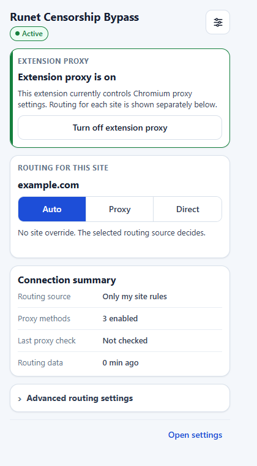
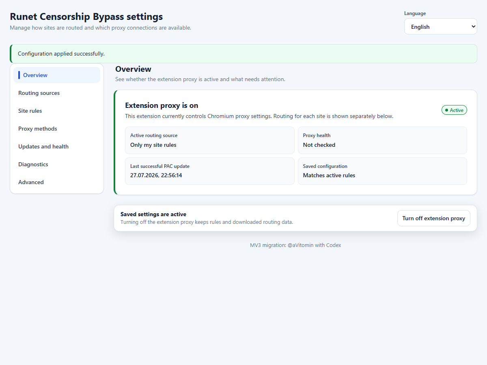
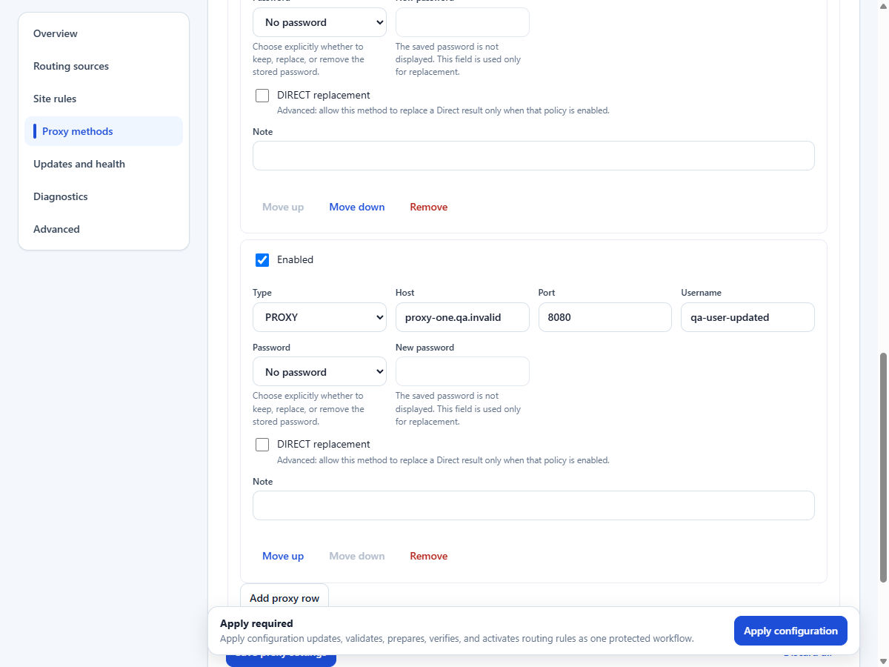
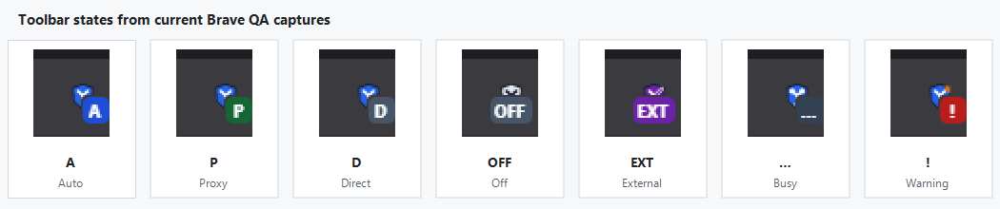

# Runet Censorship Bypass

[](https://github.com/aVitomin/runet-censorship-bypass-mv3/actions/workflows/mv3.yml)
[](https://github.com/aVitomin/runet-censorship-bypass-mv3/releases)

Runet Censorship Bypass — самостоятельно поддерживаемое расширение для Chromium,
которое выборочно направляет сайты через прокси по PAC-правилам. Оно использует
Manifest V3 и проверено в Google Chrome Stable.

> **Статус: стабильный выпуск.** Текущий публичный выпуск —
> [`v0.0.2.3`](https://github.com/aVitomin/runet-censorship-bypass-mv3/releases/tag/v0.0.2.3).
> Он устанавливается вручную из распакованного ZIP и не получает автоматические
> обновления из магазина.

[Выпуски](https://github.com/aVitomin/runet-censorship-bypass-mv3/releases) ·
[Проверки CI](https://github.com/aVitomin/runet-censorship-bypass-mv3/actions) ·
[Сообщить об ошибке](https://github.com/aVitomin/runet-censorship-bypass-mv3/issues) ·
[GPL-3.0](LICENSE)

## Текущий выпуск

- Версия: [`v0.0.2.3`](https://github.com/aVitomin/runet-censorship-bypass-mv3/releases/tag/v0.0.2.3)
- Архив (355 601 байт):
  [`runet-censorship-bypass-mv3-0.0.2.3-cb53097.zip`](https://github.com/aVitomin/runet-censorship-bypass-mv3/releases/download/v0.0.2.3/runet-censorship-bypass-mv3-0.0.2.3-cb53097.zip)
- SHA-256:
  `693d50f9ec9d1e4db54ca0760d6130532e2547bc174b1e233f101ee5fb8b1677`
- Опубликованный файл контрольной суммы:
  [`runet-censorship-bypass-mv3-0.0.2.3-cb53097.sha256.txt`](https://github.com/aVitomin/runet-censorship-bypass-mv3/releases/download/v0.0.2.3/runet-censorship-bypass-mv3-0.0.2.3-cb53097.sha256.txt)
- Установка: [пошаговая инструкция](docs/user/INSTALLATION.md)

<details>
<summary>English summary</summary>

Runet Censorship Bypass is a stable, independently maintained Chromium extension
for selective PAC-based routing. It uses Manifest V3. The latest public release
is `v0.0.2.3`; its exact payload was validated in Google Chrome Stable, including
browser-level routing, restart and proxy-ownership recovery, and authenticated
HTTP, CONNECT, and HTTPS-proxy paths. Other Chromium-compatible browsers are not
independently verified. Installation and updates remain manual and unpacked.
Firefox is not part of the current Chromium release. See the
[installation guide](docs/user/INSTALLATION.md) and
[privacy and security notes](docs/user/PRIVACY_AND_SECURITY.md).

</details>

## Что нового в v0.0.2.3

Это небольшой стабильный патч безопасности и надёжности поверх `v0.0.2.2`:

- Учёт попыток proxy-auth теперь переживает перезапуск или приостановку MV3
  service worker во время активной аутентификации 407.
- Существующий предел в две передачи учётных данных остаётся общим для старого
  и восстановленного worker.
- В сессионном учёте сохраняются только несекретные ID запроса, нормализованный
  адрес proxy, число попыток и время обновления. Сопоставление и маскирование
  учётных данных, а также HTTP, CONNECT и HTTPS-proxy аутентификация не менялись.

## Интерфейс









Снимки сделаны на реальном текущем интерфейсе в Brave. В них используются
только синтетические тестовые адреса и данные.

## Возможности

- Выборочная маршрутизация через PAC: обычный трафик не требуется отправлять
  через прокси целиком.
- Режимы **Auto**, **Proxy** и **Direct** для текущего сайта с выбором точного
  хоста или домена и поддоменов.
- Встроенные источники автоматической маршрутизации Antizapret и Anticensority,
  режим только собственных правил и доверенные пользовательские PAC-источники.
- Пользовательские HTTP/HTTPS/SOCKS-прокси-серверы, локальный Tor, Tor Browser и
  локальный прокси WARP.
- Правила сайтов с учётом границ публичных суффиксов.
- Проверка подключения и доступности настроенного прокси.
- Редактирование прокси с паролем без повторного показа сохранённого пароля.
- Архитектура Manifest V3 с восстанавливаемым service worker.
- Русский и английский интерфейс.

## Надёжность

- После полного перезапуска Chromium/Brave ранее применённый PAC безопасно
  восстанавливается только при совпадении сохранённой конфигурации, происхождения
  и хэша артефакта. Последний **Clear / Turn off** остаётся главным решением
  даже при внешнем владельце proxy settings: расширение не перезаписывает его
  настройку и очищает собственный старый PAC, когда управление возвращается.
- Проверка подключения автоматически обновляет статус активного прокси после
  запуска и по истечении срока свежести. Ошибки прошлого browser session не
  считаются свежими, временные proxy failures получают ограниченные повторы, а
  Tor Browser может восстановиться автоматически, если запущен после браузера.
- Автоматические проверки подключения не меняют Auto/Proxy/Direct, PAC-правила,
  выбранный источник или владельца proxy settings.

## Установка

1. Откройте [страницу `v0.0.2.3`](https://github.com/aVitomin/runet-censorship-bypass-mv3/releases/tag/v0.0.2.3)
   и скачайте указанный выше ZIP-архив текущего выпуска.
2. При необходимости сверьте SHA-256 с приложенным файлом `*.sha256.txt`.
3. Полностью распакуйте архив в постоянную папку.
4. Откройте `brave://extensions` или `chrome://extensions`.
5. Включите **Режим разработчика / Developer mode**.
6. Нажмите **Загрузить распакованное расширение / Load unpacked**.
7. Выберите папку, в которой непосредственно лежит `manifest.json`.

Не выбирайте сам ZIP-файл или его родительскую папку. Ручная распакованная
установка не получает автоматические обновления из магазина. Подробности,
обновление и удаление: [инструкция по установке](docs/user/INSTALLATION.md).

## Быстрый старт

1. В разделе **Automatic routing** выберите источник. Для собственных правил без
   внешнего списка доступен вариант **Only my site rules**.
2. При необходимости настройте Tor, WARP или пользовательский прокси-сервер в
   разделе **Proxy connections**.
3. Нажмите **Apply configuration**. Это единый защищённый процесс обновления,
   проверки, подготовки и применения правил.
4. Откройте popup на нужном сайте и выберите:
   - **Auto** — удалить исключение для сайта и следовать выбранному источнику;
   - **Proxy** — всегда использовать одно из включённых прокси-подключений;
   - **Direct** — явно обходить прокси расширения.
5. Используйте **Turn off extension proxy**, чтобы вернуть Chromium к системным
   настройкам прокси, не удаляя сохранённые правила и кэш.

Глобальное состояние и правило текущего сайта независимы: **Turn off** отключает
управление прокси во всём браузере, а Auto/Proxy/Direct меняют только маршрут
выбранного сайта. Проверка подключения показывает доступность маршрута, но не
доказывает успешную аутентификацию или отсутствие DNS-утечек.

Значки панели: `A` — Auto, `P` — Proxy, `D` — Direct, `OFF` — прокси расширения
выключен, `EXT` — настройками владеет другое расширение или политика, `…` —
операция выполняется, `!` — требуется внимание.

## Поддержка браузеров

| Браузер | Текущий статус |
| --- | --- |
| Google Chrome Stable | Точный payload `v0.0.2.3` прошёл trusted CI smoke; расширенная Windows QA дополнительно покрыла загрузку MV3, Auto/Proxy/Direct, перезапуск и восстановление, смену владельца proxy settings, ошибки PAC и аутентификацию HTTP/CONNECT/HTTPS-прокси. |
| Brave | Более ранние сборки прошли обновление профиля, Apply/Clear/restart, popup и options smoke QA в Chromium 151.0.7922.169; текущий стабильный выпуск отдельно в Brave не перепроверялся. |
| Другие Chromium-совместимые браузеры | Ожидается совместимость с необходимыми MV3 API; требуется проверка конкретного браузера и версии. |
| Firefox | Не входит в текущий выпуск для Chromium. |

## Безопасность и приватность

- Пароли пользовательских прокси-серверов хранятся локально для ответа на
  proxy-auth запросы, не добавляются в сгенерированный PAC и маскируются в
  ответах popup/options.
- Адрес пользовательского PAC проверяется до загрузки и повторно после
  перенаправления. Загрузка ограничена тайм-аутом, размером и строгой
  проверкой UTF-8.
- Загруженный PAC обрабатывается как данные и передаётся Chromium; код
  расширения не выполняет его через `eval` или `Function`.
- Исходный код MV3 не содержит телеметрии или аналитики. Сетевые обращения
  нужны для PAC-источников и запускаемой пользователем проверки маршрута.
- Расширение проверяет владельца настройки прокси и не должно молча
  перезаписывать управление другого расширения или политики.

Известные границы `v0.0.2.3`: установка и обновления остаются ручными; PAC
применяется с `mandatory: false`, поэтому ошибки разбора или выполнения PAC
могут привести к маршруту DIRECT; владение через машинную политику проверялось
регрессионно без изменения реальной политики управляемого компьютера; между
последней проверкой владельца и нативным применением настройки остаётся узкая
гонка Chromium. Детерминированная loopback/NetLog QA не доказывает отсутствие
утечек во всех реальных сочетаниях DNS, VPN и системного resolver.

Подробнее: [приватность и безопасность](docs/user/PRIVACY_AND_SECURITY.md) и
[решение проблем](docs/user/TROUBLESHOOTING.md).

## Документация

- [Обзор документации](docs/README.md)
- [Установка и обновление](docs/user/INSTALLATION.md)
- [Руководство пользователя](docs/user/USER_GUIDE.md)
- [Решение проблем](docs/user/TROUBLESHOOTING.md)
- [Приватность и безопасность](docs/user/PRIVACY_AND_SECURITY.md)
- [Разработка](docs/development/DEVELOPMENT.md)
- [Архитектура](docs/development/ARCHITECTURE.md)
- [Тестирование](docs/development/TESTING.md)
- [Процесс выпуска](docs/development/RELEASE_PROCESS.md)
- [История и исходный проект](docs/legacy/UPSTREAM_README.md)
- [Участие в проекте](CONTRIBUTING.md)
- [Сообщение об уязвимости](SECURITY.md)

## Быстрый старт для разработки

Проверенная среда CI — Node.js 22. Поддерживаемого корневого npm-пакета нет:
все команды разработки явно направляйте в канонический пакет
`extensions/chromium/runet-censorship-bypass`. Устаревшие funding metadata и
lifecycle удалены; историческая атрибуция и сведения о спонсорах сохранены в
[README исходного проекта](docs/legacy/UPSTREAM_README.md).

```powershell
node ./scripts/verify-docs.mjs
npm ci --prefix ./extensions/chromium/runet-censorship-bypass
npm --prefix ./extensions/chromium/runet-censorship-bypass run test:pac
npm --prefix ./extensions/chromium/runet-censorship-bypass run test:mv3
npm --prefix ./extensions/chromium/runet-censorship-bypass run lint:mv3
npm --prefix ./extensions/chromium/runet-censorship-bypass run build:mv3
```

Результат сборки:
`extensions/chromium/runet-censorship-bypass/build/extension-chromium-mv3`.

## Статус проекта и участие

Отзывы и сообщения о проблемах приветствуются в
[Issues](https://github.com/aVitomin/runet-censorship-bypass-mv3/issues).
Укажите браузер и версию, ОС, чистую установку или обновление, источник,
прокси-подключение, текущий маршрут, шаги воспроизведения и очищенные от
чувствительных данных ошибки. Никогда не публикуйте пароли, приватные прокси,
токены, cookies, URL с учётными данными, приватный PAC или историю посещений.

Правила для изменений находятся в [CONTRIBUTING.md](CONTRIBUTING.md), политика
безопасности — в [SECURITY.md](SECURITY.md).

## Происхождение и лицензия

Runet Censorship Bypass возник на основе
[`anticensority/runet-censorship-bypass`](https://github.com/anticensority/runet-censorship-bypass)
и сохраняет работу, историю и GPL-3.0 атрибуцию исходных авторов и участников.
Текущий продукт для Chromium поддерживается независимо; его реализация Manifest
V3, интерфейс, тесты и процесс выпуска развиваются в этом репозитории. Код
распространяется по [GNU GPL v3](LICENSE).

<details>
<summary>Original project README and legacy instructions</summary>

The original README is preserved at
[docs/legacy/UPSTREAM_README.md](docs/legacy/UPSTREAM_README.md).

These instructions may describe old MV2, Firefox, store, or upstream release
workflows and are not the current installation guide.

</details>
