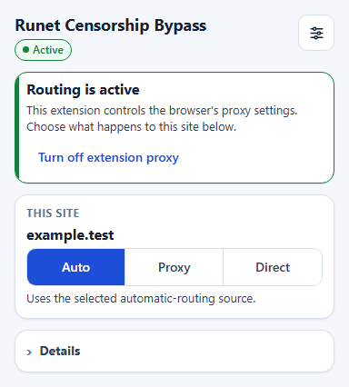
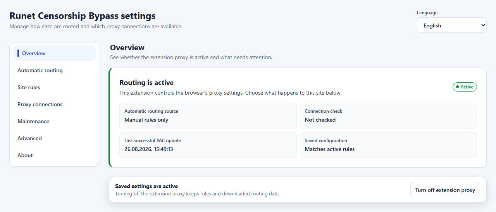
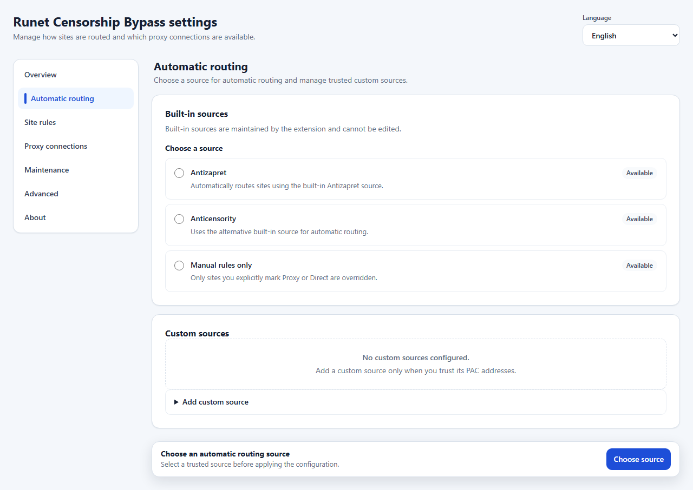
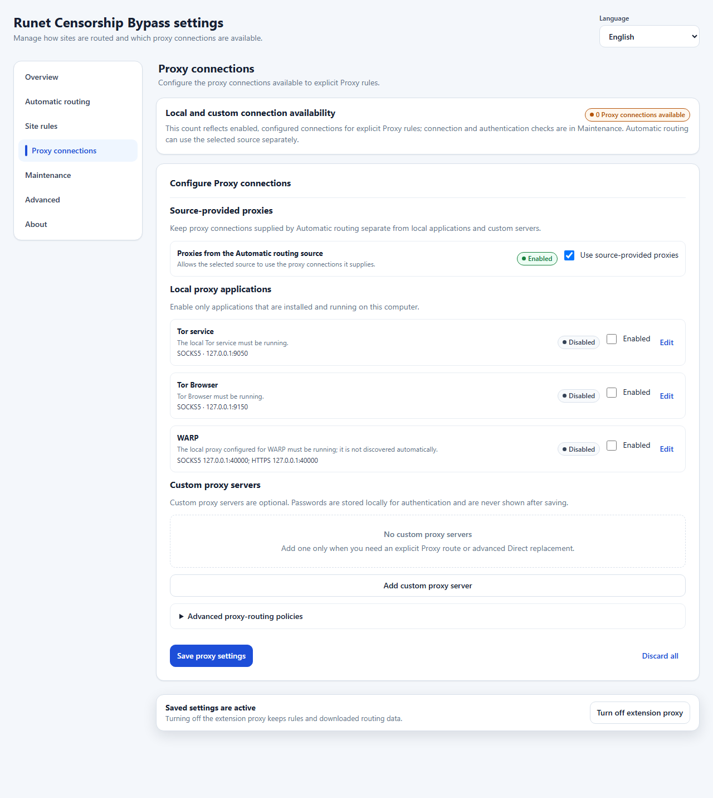

# Runet Censorship Bypass

[](https://github.com/aVitomin/runet-censorship-bypass-mv3/releases)

Runet Censorship Bypass — расширение для Chromium с выборочной маршрутизацией:
заблокированные или выбранные сайты могут использовать автоматическую
маршрутизацию либо настроенные прокси-подключения, а остальной трафик остаётся
прямым.

Текущий продукт поддерживает Chromium и проверяется в Google Chrome Stable.
Последний опубликованный стабильный выпуск —
[`v0.0.3.0`](https://github.com/aVitomin/runet-censorship-bypass-mv3/releases/tag/v0.0.3.0).
Он устанавливается вручную из распакованного ZIP и не обновляется через магазин.

[Скачать стабильный выпуск](https://github.com/aVitomin/runet-censorship-bypass-mv3/releases/tag/v0.0.3.0) ·
[Инструкция по установке](docs/user/INSTALLATION.md) ·
[Руководство пользователя](docs/user/USER_GUIDE.md) ·
[Сообщить о проблеме](https://github.com/aVitomin/runet-censorship-bypass-mv3/issues)

<details>
<summary>English summary</summary>

Runet Censorship Bypass is a Chromium extension for selective website routing:
blocked or chosen sites can use automatic routing or configured proxy
connections while the rest of browsing stays direct. The latest published
stable release is `v0.0.3.0`. Installation and updates are manual and unpacked;
Firefox is not part of the current Chromium release. See the
[installation guide](docs/user/INSTALLATION.md) and
[user guide](docs/user/USER_GUIDE.md).

</details>

## Что умеет расширение

- Автоматически выбирает маршрут для сайтов по встроенному или доверенному
  пользовательскому источнику.
- Даёт явный выбор **Auto**, **Proxy** или **Direct** для текущего сайта и
  поддерживает правила для точного хоста либо домена с поддоменами.
- Работает с локальными Tor, Tor Browser и WARP, а также с пользовательскими
  HTTP, HTTPS, SOCKS4 и SOCKS5 прокси-серверами.
- Показывает, когда настройки ещё не применены, и не перехватывает управление
  прокси у другого расширения или политики браузера.
- Предоставляет ручную проверку подключения, обновление данных маршрутизации и
  очищенную диагностику.
- Имеет русский и английский интерфейс.

Расширение не является VPN-сервисом и не обещает анонимность или отсутствие
DNS-утечек.

## Установка

### Текущий стабильный выпуск

- Версия: [`v0.0.3.0`](https://github.com/aVitomin/runet-censorship-bypass-mv3/releases/tag/v0.0.3.0)
- Архив (361 977 байт):
  [`runet-censorship-bypass-mv3-0.0.3.0-cd59e14.zip`](https://github.com/aVitomin/runet-censorship-bypass-mv3/releases/download/v0.0.3.0/runet-censorship-bypass-mv3-0.0.3.0-cd59e14.zip)
- SHA-256:
  `68a32aa9162d5ba8b2cd9070c2eba6e5eb055434b899c284107c55d3e5a55635`
- Опубликованный файл контрольной суммы:
  [`runet-censorship-bypass-mv3-0.0.3.0-cd59e14.sha256.txt`](https://github.com/aVitomin/runet-censorship-bypass-mv3/releases/download/v0.0.3.0/runet-censorship-bypass-mv3-0.0.3.0-cd59e14.sha256.txt)

1. Скачайте ZIP со страницы стабильного выпуска.
2. При необходимости сверьте SHA-256 с опубликованным файлом контрольной
   суммы.
3. Полностью распакуйте архив в постоянную папку.
4. Откройте `chrome://extensions` или страницу управления расширениями вашего
   Chromium-браузера.
5. Включите **Режим разработчика / Developer mode**.
6. Нажмите **Загрузить распакованное расширение / Load unpacked** и выберите
   папку, в которой непосредственно лежит `manifest.json`.

Не выбирайте ZIP или его родительскую папку. Распакованная папка должна
оставаться на месте: браузер загружает расширение прямо из неё. Обновления также
устанавливаются вручную. Подробные шаги, проверка архива, обновление и удаление —
в [инструкции по установке](docs/user/INSTALLATION.md).

## Быстрый старт

1. В **Automatic routing** выберите источник автоматической маршрутизации.
   Вариант **Manual rules only** подходит, если нужны только собственные правила.
2. При необходимости откройте **Proxy connections** и включите локальное или
   пользовательское подключение для явных правил Proxy.
3. Нажмите глобальную кнопку **Apply configuration**. Сохранение отдельных
   полей не изменяет активную маршрутизацию до Apply.
4. После настройки используйте popup для ежедневного выбора маршрута текущего
   сайта.

## Ежедневное использование

В popup всегда видны текущее глобальное состояние, имя сайта и три режима:

- **Auto** — следует политике выбранного источника автоматической
  маршрутизации.
- **Proxy** — явно использует доступные настроенные Proxy connections. Если
  пригодного подключения нет, конфигурацию нельзя применить; этот режим не
  подменяется политикой источника или намеренным Direct-маршрутом.
- **Direct** — явно обходит прокси расширения для выбранной области сайта.

Для Proxy и Direct можно выбрать точный хост либо домен с поддоменами, когда это
применимо. Изменение показывает **Not applied** и начинает действовать только
после существующего **Apply**. Команда **Turn off extension proxy** отключает
глобальное управление, но сохраняет правила и загруженные данные.

Подробнее: [руководство пользователя](docs/user/USER_GUIDE.md).

## Интерфейс

<p align="center">
  <a href="docs/assets/readme/popup-daily-auto.png"></a><br>
  <sub>Popup: ежедневный выбор маршрута</sub>
</p>

<p align="center">
  <a href="docs/assets/readme/options-overview.png"></a><br>
  <sub>Overview: состояние конфигурации</sub>
</p>

<p align="center">
  <a href="docs/assets/readme/options-automatic-routing.png"></a><br>
  <sub>Automatic routing: выбор источника при первой настройке</sub>
</p>

<p align="center">
  <a href="docs/assets/readme/options-proxy-connections.png"></a><br>
  <sub>Proxy connections: компактный список подключений</sub>
</p>

Все кадры сняты с английским интерфейсом и синтетическим адресом
`example.test`; в них нет личных данных, реальных прокси или учётных данных.

## Возможности и настройки

Страница Options организована по задачам:

- **Overview** — активное состояние и требующееся действие.
- **Automatic routing** — встроенные и доверенные пользовательские источники.
- **Site rules** — правила для хостов и доменов.
- **Proxy connections** — источник, локальные приложения и пользовательские
  прокси-серверы с раскрываемым редактором.
- **Maintenance** — обновление данных, проверка подключения и диагностика.
- **Advanced** — редкие политики маршрутизации, миграция и экспертные операции.
- **About** — версия, ссылки, лицензия и атрибуция.

Технические параметры источников и прокси остаются доступны, но не мешают
обычной установке и ежедневному выбору маршрута.

## Приватность и безопасность

- Учётные данные пользовательского прокси хранятся локально для proxy-auth;
  сохранённый пароль не возвращается в интерфейс и не включается в правила
  маршрутизации.
- Расширение проверяет владельца настройки прокси и не перезаписывает управление
  другого расширения или политики.
- Исходный код текущего продукта не содержит телеметрии или аналитики. Сетевые
  обращения нужны источникам маршрутизации и запущенной пользователем проверке.
- Загруженные правила обрабатываются как недоверенные данные; фактическое
  применение и возможный аварийный Direct-маршрут зависят также от поведения
  Chromium.

Полная модель разрешений, хранения, сетевых обращений и границ доверия описана в
[документе о приватности и безопасности](docs/user/PRIVACY_AND_SECURITY.md).

## Помощь

- [Установка, обновление и удаление](docs/user/INSTALLATION.md)
- [Руководство пользователя](docs/user/USER_GUIDE.md)
- [Решение проблем](docs/user/TROUBLESHOOTING.md)
- [Приватность и безопасность](docs/user/PRIVACY_AND_SECURITY.md)
- [Обзор всей документации](docs/README.md)
- [Issues текущего репозитория](https://github.com/aVitomin/runet-censorship-bypass-mv3/issues)
- [Сообщение об уязвимости](SECURITY.md)

При обращении укажите браузер и версию, ОС, версию расширения, текущий режим и
шаги воспроизведения. Не публикуйте пароли, приватные proxy endpoints, токены,
cookies, URL с учётными данными, приватные правила или историю посещений.

## Поддержка браузеров

Текущий опубликованный выпуск проверен в Google Chrome Stable. Другие браузеры
на Chromium с необходимыми Manifest V3 API могут работать, но не проверяются
отдельно для каждого выпуска. Firefox не входит в текущий Chromium-релиз.

## Происхождение и лицензия

Runet Censorship Bypass возник на основе
[`anticensority/runet-censorship-bypass`](https://github.com/anticensority/runet-censorship-bypass)
и сохраняет работу, историю и GPL-3.0 атрибуцию исходных авторов и участников.
Текущий продукт для Chromium поддерживается независимо. Код распространяется
по [GNU GPL v3](LICENSE); исходные материалы и исторические инструкции сохранены
в [архивном README](docs/legacy/UPSTREAM_README.md).

## Разработка и техническая информация

[](https://github.com/aVitomin/runet-censorship-bypass-mv3/actions/workflows/mv3.yml)

- [Подготовка среды и разработка](docs/development/DEVELOPMENT.md)
- [Архитектура MV3](docs/development/ARCHITECTURE.md)
- [Тестирование и браузерная QA](docs/development/TESTING.md)
- [Процесс выпуска](docs/development/RELEASE_PROCESS.md)
- [Участие в проекте](CONTRIBUTING.md)

Проверенная среда CI — Node.js 22. Корневого npm-пакета нет; команды направляют
в `extensions/chromium/runet-censorship-bypass`. Краткий набор проверок:

```powershell
node ./scripts/verify-docs.mjs
npm ci --prefix ./extensions/chromium/runet-censorship-bypass
npm --prefix ./extensions/chromium/runet-censorship-bypass run test:pac
npm --prefix ./extensions/chromium/runet-censorship-bypass run test:mv3
npm --prefix ./extensions/chromium/runet-censorship-bypass run lint:mv3
npm --prefix ./extensions/chromium/runet-censorship-bypass run build:mv3
```

Сведения о внутренних механизмах, тестовых матрицах, миграции и выпуске намеренно
находятся в документации для разработчиков и в `docs/legacy/**`, а не в
пользовательском пути установки.
